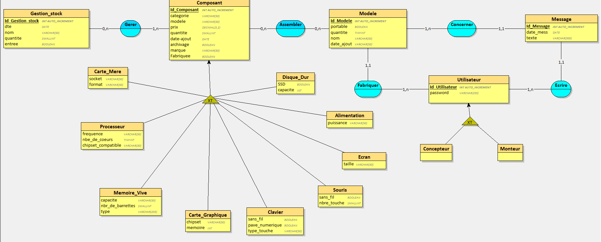

# Montage-d-ordinateur

## Structure

Pour la structure du projet :
* dans le dossier Classes le fichier Composant.php est parrent de tous les fichiers .php sauf de Commentaire.php.
Dans le dossier pages :
* nous l'avons découpé en 3 sous dossier :
1. Concepteur
2. Monteur
3. Commun (tous les fichiers que le Concepteur et le Monteur ont en commun).

## MCD

Notre MCD se trouve dans le dossier images de notre projet

